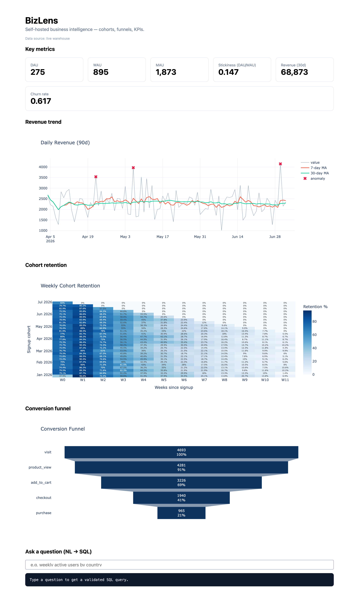
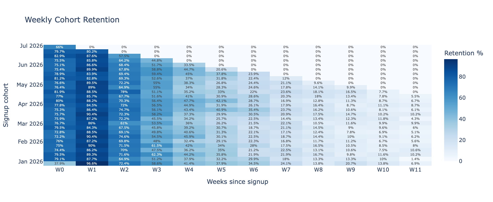
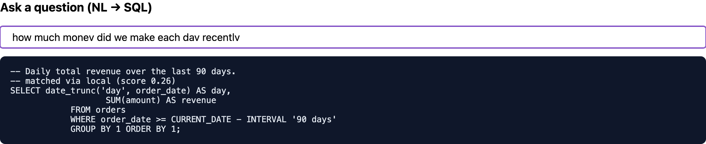
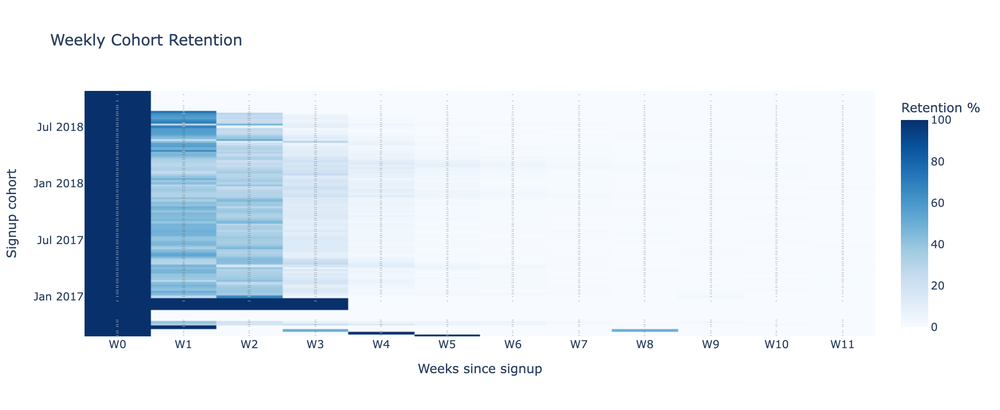

# BizLens

**Self-hosted Business Intelligence & Analytics platform** - SQL-powered cohort
analysis, funnel analysis, and KPI dashboards with statistical rigour and
AI-generated reporting. Think a lightweight, self-hostable Metabase where
*differences between cohorts are tested, not just displayed.*

[](https://bizlens-b33l.onrender.com)
[](https://github.com/PasadKunal/bizlens/actions/workflows/ci.yml)


**Live demo:** https://bizlens-b33l.onrender.com (hosted free on Render + Neon; the first load can take ~50s while the instance wakes)



<sub>Live dashboard: KPI cards, revenue trend with anomaly detection, a 12-week cohort-retention heatmap, and the conversion funnel - all served from Postgres via Redis-cached queries.</sub>

---

## Why BizLens

Non-technical stakeholders can't answer business questions from data without an
analyst; analysts burn hours on repetitive ad-hoc queries and reporting.
BizLens self-serves both - with the statistical discipline (significance
testing, multiple-comparison correction, data-quality gating) that most BI
projects skip.

## Architecture

```
┌──────────────────────────────────────────────────────────────────┐
│  dashboard/  (Plotly Dash)                                         │
│  KPI cards · retention heatmap · funnel chart · trend · NL2SQL     │
├──────────────────────────────────────────────────────────────────┤
│  api/  (FastAPI)                                                   │
│  JWT auth - Postgres role · KPI / cohort / funnel / ad-hoc / report│
├─────────────────┬──────────────────┬─────────────────────────────┤
│  analytics/     │  sql/            │  reporting/                  │
│  cohort ·funnel │  query library · │  data-quality gate ·         │
│  kpi ·trend ·   │  ETL ·optimizer ·│  GPT-4o insights ·           │
│  stats ·anomaly │  schema validate │  PDF/CSV ·APScheduler        │
├─────────────────┴──────────────────┴─────────────────────────────┤
│  Redis  (pre-aggregated KPI cache, 5-min refresh - sub-2s load)   │
│  PostgreSQL + pgvector  (SELECT-only analyst role · RLS)          │
│  Dataset: Brazilian Olist e-commerce (or synthetic generator)     │
└──────────────────────────────────────────────────────────────────┘
```

## Features

### SQL Analytics Engine
- **Read-only analyst role** - all analytics run under a `SELECT`-only Postgres role; no query can mutate data ([`postgres_roles.sql`](bizlens/infra/postgres_roles.sql)).
- **Pre-built query library** - retention curves, funnels, cohort tables, revenue, DAU/MAU/WAU ([`query_library.py`](bizlens/sql/query_library.py)).
- **Query optimizer** - `EXPLAIN ANALYZE` parser that suggests composite-index candidates for sequential scans ([`query_optimizer.py`](bizlens/sql/query_optimizer.py)).

### Cohort Analysis
- **Retention matrix** - the full 12x12 cohort grid in one window-function query ([`cohort_analysis.py`](bizlens/analytics/cohort_analysis.py)).
- **Significance testing between cohorts** - chi-squared with **Bonferroni** correction for multiple cohort comparisons.
- **Churn-signal detection** - flags cohorts whose week-4 retention falls more than 2 standard deviations below baseline.



### Funnel Analysis
- Multi-step drop-off, **A/B funnel comparison** with significance testing, and time-to-convert distributions ([`funnel_analysis.py`](bizlens/analytics/funnel_analysis.py)).

### KPI Dashboard
- DAU/MAU/revenue/churn cards, moving-average trends, and **Welford online anomaly detection** - running mean/variance with *zero stored history* ([`anomaly.py`](bizlens/analytics/anomaly.py)).
- **Redis caching** for sub-2s dashboard load.

### Automated Reporting
- Weekly digest with **GPT-4o narrative summaries** (graceful template fallback with no API key) ([`insight_generator.py`](bizlens/reporting/insight_generator.py)).
- **Data-quality gate** - row counts, null-key checks, value bounds, spike detection - *no report ships on bad data* ([`data_quality_checker.py`](bizlens/reporting/data_quality_checker.py)).
- PDF/CSV export, APScheduler delivery.

### NL to SQL (RAG)
- Ask *"how much money came from different sources"* and get a **validated** pre-built query back. The query library is embedded into a **pgvector** table and matched by cosine distance (`<=>`, HNSW index); a local hashing embedder keeps it working offline/in CI, with an OpenAI backend for true semantics ([`vector_store.py`](bizlens/sql/vector_store.py), [`embeddings.py`](bizlens/nlp/embeddings.py)).



### Multi-user data scoping (row-level security)
- Each user's JWT carries a **scope**; the ad-hoc sandbox sets a Postgres session variable that RLS policies filter on. A `BR`-scoped user cannot read another region's rows **even with a hand-crafted `WHERE` clause** - the filter is enforced by Postgres, not the app ([`rls.py`](bizlens/sql/rls.py)). Try it: log in as `analyst` (all regions) vs `analyst_br` (Brazil only).

## Quick start (under 5 minutes)

```bash
# 1. Create and activate the virtual environment
python -m venv blvenv && source blvenv/bin/activate

# 2. Install
pip install -r requirements-dev.txt && pip install -e .

# 3. Generate a synthetic dataset (or drop the Olist CSVs into data/processed)
python scripts/generate_sample_data.py

# 4. Run the tests
pytest

# 5. Launch the dashboard (renders demo data if no DB is running)
python -m bizlens.dashboard.app     # http://localhost:8050
```

### Full stack with Docker

```bash
cp .env.example .env
docker compose -f bizlens/infra/docker-compose.yml up --build
# API:       http://localhost:8000/docs
# Dashboard: http://localhost:8050
```

## Design notes

**Correlation is not causation.** BizLens surfaces *descriptive* findings (e.g. "paid
users retain 34% worse than organic"). It deliberately does **not** claim
causation - that requires an experiment or quasi-experimental design. Separating
descriptive analysis from causal inference is a core statistical-maturity signal.

**Why the read-only role?** Every analytics query runs through
`ANALYST_DATABASE_URL`, a role with `SELECT` grants only. Combined with
per-user Postgres roles and row-level security, this makes data leakage between
users a database-enforced impossibility rather than an application convention.

**Why Welford?** A live KPI stream shouldn't require storing full history to
detect anomalies. Welford maintains running mean/variance in O(1) memory and
flags points beyond 2.5 sigma - see [`test_anomaly.py`](tests/test_anomaly.py) for
the equivalence check against NumPy.

## Project layout

```
bizlens/
├── analytics/   cohort · funnel · kpi · trend · statistical_tests · anomaly
├── sql/         query_library · etl_pipeline · schema_validator · query_optimizer
├── reporting/   data_quality_checker · insight_generator · report_builder · scheduler
├── dashboard/   app · kpi_cards · retention_heatmap · funnel_chart · trend_chart · nl_to_sql
├── api/         main (FastAPI routes) · auth (JWT + Postgres role)
└── infra/       docker-compose · Dockerfile · postgres_roles.sql
scripts/         generate_sample_data · init_db · deploy_seed · capture_screenshots
tests/           unit tests for every analytics + reporting module
render.yaml      Render Blueprint for a free deploy (see DEPLOY.md)
```

## Deploy

Host the whole app (dashboard + API) for free on Neon (Postgres) + Render, with
no Redis required. Step-by-step runbook: [DEPLOY.md](DEPLOY.md).

## Roadmap

| Phase | Status | Scope |
|-------|--------|-------|
| 1 - Data layer | ✅ | Postgres read-only role, ETL, schema validation, data-quality checks |
| 2 - Cohort analysis | ✅ | Retention matrix, heatmap, chi-squared + Bonferroni |
| 3 - Funnel analysis | ✅ | Drop-off, A/B comparison, time-to-convert |
| 4 - KPI dashboard | ✅ | KPI engine, Welford anomaly detection, Redis cache, Dash UI |
| 5 - Reporting | ✅ | Data-quality gate, GPT-4o summaries (optional key), PDF/CSV, APScheduler digest |
| 6 - Polish | ✅ | JWT auth + sandboxed ad-hoc queries · pgvector NL-to-SQL · per-user RLS enforcement · real Olist loader · Postgres-in-CI |

### Live data path

The API and dashboard read through a single data-access layer
([`warehouse.py`](bizlens/warehouse.py)) that runs every query under the
read-only analyst role and caches KPI cards + the revenue trend in Redis.

```bash
# with the Docker stack up (postgres + redis):
python scripts/init_db.py                  # pgvector + read-only role + grants
python scripts/generate_sample_data.py     # today-anchored synthetic dataset
#   ...or use the real Kaggle data (drop the CSVs into data/raw/olist first):
#   python -m bizlens.sql.olist_loader --raw data/raw/olist --out data/processed
python -m bizlens.sql.etl_pipeline         # load into Postgres, apply RLS
python -m bizlens.sql.vector_store         # build the NL-to-SQL embeddings
uvicorn bizlens.api.main:app --port 8000   # API:  http://localhost:8000/docs
python -m bizlens.dashboard.app            # UI:   http://localhost:8050
```

Get a token and run a sandboxed query:

```bash
TOKEN=$(curl -s -X POST localhost:8000/auth/token -d 'username=analyst&password=analyst' | jq -r .access_token)
curl -s localhost:8000/kpi/cards | jq
curl -s -X POST localhost:8000/query/adhoc -H "Authorization: Bearer $TOKEN" \
     -H 'Content-Type: application/json' \
     -d '{"sql":"SELECT segment, COUNT(*) FROM users GROUP BY segment"}' | jq
```

### Running on real data

The same platform on the real **Brazilian Olist** e-commerce dataset (~96k customers, 99k orders). Retention across 99 weekly cohorts (Jan 2017-Jul 2018) shows the tell-tale shape of a transactional marketplace - a strong signup week, then a steep drop as most customers are one-time buyers. RLS scopes each user to a Brazilian state (`SP` alone has 40k customers), and the funnel adapts to Olist's order lifecycle (`purchase -> checkout -> delivered`).



## License

MIT - see [LICENSE](LICENSE).
